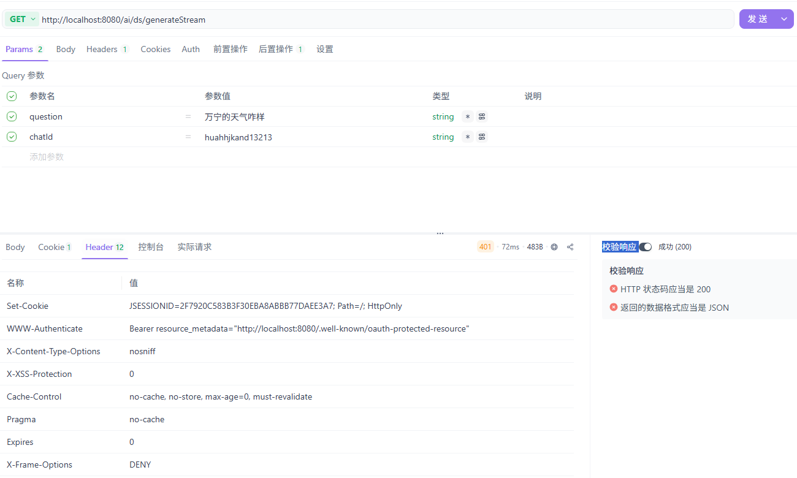
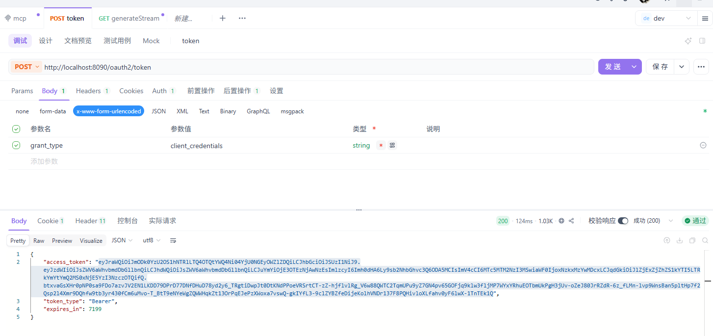
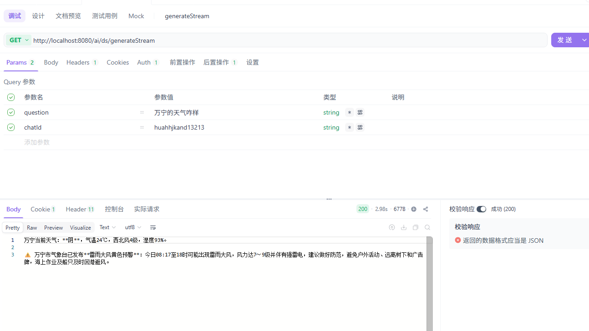
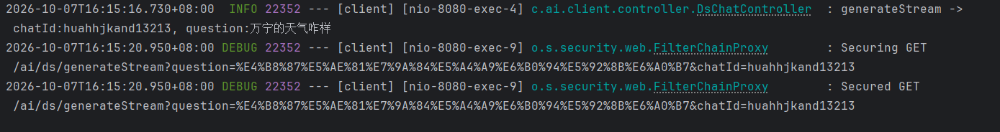
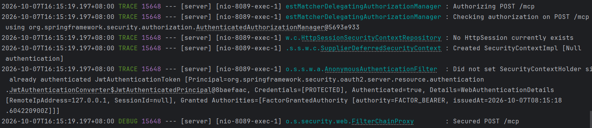

## 前言

目前SpringAI框架虽然迭代到了2.0.1版本，但是对于很多东西都还是需要自己拓展，对于目前而言MCP的鉴权问题，虽然Spring社区有`mcp-security`模块
但是这个模块目前并不是Spring官方的推荐，所以我个人目前还是倾向于个人拓展。因为和前端交互基本都是响应式的输出，所以一下的操作都是基于返回
`Flux<String>`格式的方案

## 全手动

### 客户端

#### 调用链路

```text
业务线程（MVC，有 SecurityContext）
    │
    │ 1. contextWrite(ctx -> ctx.put("authentication", auth))
    ▼
Reactor Context（响应式上下文存放 authentication）
    │
    │ 2. Spring AI 自动捕获，存入 ToolCallReactiveContextHolder（ThreadLocal）
    ▼
ToolCallReactiveContextHolder
    │
    │ 3. McpTransportAuthCustomizer 中直接 getContext() 读取
    ▼
HTTP 请求头 Authorization: Bearer xxx

```
第一步 就是需要在控制层把接收到鉴权参数，传入的响应式的上下文中，`contextWrite`是Spring WebFlux中的一个操作符，可以把数据写入到响应式上下文中
`contextWrite`只能写在调用链的末尾，并且`contextWrite`只对下游可见
```java
Flux<String> res = dsChatClient.prompt()
                .user(question)
                .advisors(advisorSpec -> advisorSpec.param(ChatMemory.CONVERSATION_ID, key))//传递会话id
                .stream()
                .content()
                .contextWrite(ctx -> ctx.put("authentication","Bearer token-123"));
```
然后需要在`McpTransportAuthCustomizer`把参数获取并注入到请求头中，手动实现时，`ToolCallReactiveContextHolder` 里已经 包含了 Reactor Context 的全部
数据，`McpTransportAuthCustomizer` 可以直接从中读取，不需要额外配置 transportContextProvider 来搬运到 `McpTransportContext`。`McpTransportContext` 是 `mcp-security` 模块方案中的中间容器，手动实现可以跳过


```java
@Component
public class McpTransportAuthCustomizer
        implements McpClientCustomizer<HttpClientStreamableHttpTransport.Builder> {

    @Override
    public void customize(String name, HttpClientStreamableHttpTransport.Builder builder) {

        builder.httpRequestCustomizer((requestBuilder, method, endpoint, body, context) -> {
            var ctx = ToolCallReactiveContextHolder.getContext();
            if (ctx.hasKey("authentication")) {
                requestBuilder.header("Authorization", ctx.get("authentication").toString());
            }
        });
    }
}

```

这样的话客户端就完整地把鉴权地参数，或者一些其他的参数传递给了Mcp服务器了，然后现在需要的就是在服务端获取

### 服务端

服务端就很简单了，只需要在http的请求头中获取参数，然后存放到上下文中，其他的方法就可以直接获取了，重点就是从`TransportContextExtractor`中获取传递过来的参数

```java
@Bean
    public WebMvcStreamableServerTransportProvider streamableTransportProvider() {

        return WebMvcStreamableServerTransportProvider.builder()
                .mcpEndpoint("/mcp")
                .contextExtractor(request -> {
                    // 从 HTTP 请求头中提取 Authorization
                    String authHeader = request.headers()
                            .firstHeader("Authorization");

                    Map<String, Object> context = new HashMap<>();
                    context.put("authorization", authHeader);

                    return McpTransportContext.create(context);
                })
                .build();

    }

```

最后就是在逻辑中校验了，我这里没有登录，所以随便传入的一个字符串作为鉴权的参数,`McpTransportContext`对于`stateless`和`steamable`都支持

```java
@McpTool(description = "根据城市名称查询该城市的实时天气信息，包括天气状况、温度、风向、风力、湿度等")
    public String getWeatherByCity(
            @McpToolParam(description = "城市名称，支持中文（如：北京、上海）或英文（如：Tokyo）") String city,
            McpTransportContext context) {

        String url = "/api/v1/misc/weather?city=" + city;
        // 1. 从上下文中取出 Authorization 头
        String authHeader = (String) context.get("authorization");


        if (!"Bearer token-123".equals(authHeader)) {
            log.warn("鉴权失败：令牌无效");
            return "鉴权失败：令牌无效";
        }

        // 3. 鉴权通过，返回数据
        try {
            String responseBody = restClient.get()
                    .uri(url)
                    .retrieve()
                    .body(String.class);
            return responseBody;
        } catch (Exception e) {
            return "查询天气失败：" + e.getMessage();
        }


    }
```

## 全自动

全自动的话就是需要使用到`mcp-security`模块，这个模块就是把`Spring-Security`的思维使用到了MCP中，用`Spring-Security`的方式来鉴权，核心就是`@PreAuthorize`注解，然后
我这里是参考官方的建议，采用了`客户端`，`授权服务器`,`mcp服务器`分层的一个方式，还有一种就是`mcp服务器既当作授权服务器也当成资源服务器的方式`

### 客户端

啊啊啊啊啊，无解了，试了一下午，自动配置始终有问题，要么就是获取不到token，暂时先不写了，后面发现问题了把全自动注入再补上

`tips`看了`mcp-security`作者的例子后终于走通了

作者在例子里面多引入了一个依赖包
```xml
<dependency>
    <groupId>org.springaicommunity</groupId>
    <artifactId>mcp-client-security-spring-boot</artifactId>
    <version>0.1.15-SNAPSHOT</version>
</dependency>

```
除了这个官网文档里面没有看到的依赖以外，剩下的就是文档里面写了必须引入的依赖

```xml

        <dependency>
            <groupId>org.springframework.boot</groupId>
            <artifactId>spring-boot-starter-webmvc</artifactId>
        </dependency>
        <!-- 我这里是接入的deepseek的模型，所以引入的是deepseek的包 -->
<!--        <dependency>-->
<!--            <groupId>org.springframework.ai</groupId>-->
<!--            <artifactId>spring-ai-starter-model-deepseek</artifactId>-->
<!--        </dependency>-->
        <dependency>
            <groupId>org.springframework.ai</groupId>
            <artifactId>spring-ai-starter-mcp-client</artifactId>
        </dependency>
        <dependency>
            <groupId>org.springaicommunity</groupId>
            <artifactId>mcp-client-security</artifactId>
            <version>${mcp.security.version}</version>
        </dependency>
        <dependency>
            <groupId>org.springframework.boot</groupId>
            <artifactId>spring-boot-starter-oauth2-client</artifactId>
        </dependency>
        <dependency>
            <groupId>org.springframework.boot</groupId>
            <artifactId>spring-boot-starter-oauth2-resource-server</artifactId>
        </dependency>

```
yml的配置，这里的配置，主要也是参考了官网文档和模块作者的例子，这里不得不吐槽一下官方的文档，给出的配置参数如果直接用根本跑不起来，需要参照作者的例子，然后
对照补充

```yaml
  security:
    oauth2:
      client:
        registration:
          authserver:
            client-id: leezihongClient
            client-secret: leezihong-secret
            authorization-grant-type: client_credentials
            provider: authserver
        provider:
          authserver:
            issuer-uri: http://localhost:8090
      resourceserver:
        jwt:
          issuer-uri: http://localhost:8090
    mcp:
      client:
        type: sync
        initialized: false
        toolcallback:
          enabled: true
        streamable-http:
          connections:
            localMcpServer:
              url: http://localhost:8089
              endpoint: /mcp
        authentication:
          dynamic-client-registration:
            enabled: true
            allow-loopback-addresses: true

```

因为我是从前端调用开始走的，框架获取到了token后传入到上下文，这里主要的就是`.contextWrite(AuthenticationMcpTransportContextProvider.writeToReactorContext())`这一段,其实 和全手动差不多

都是需要获取token，然后传递，加了`AuthenticationMcpTransportContextProvider.writeToReactorContext()`就不需要手动传递了，框架自己获取并且传递

```java
Flux<String> res = dsChatClient.prompt()
                .user(question)
                .advisors(advisorSpec -> advisorSpec.param(ChatMemory.CONVERSATION_ID, key))//传递会话id
                .stream()
                .content()
                .contextWrite(AuthenticationMcpTransportContextProvider.writeToReactorContext());
```
这一步就是最重要的一步，参数的传递，然后就是`SpringSecurity`的相关配置了，需要加一个安全过滤器链路，

```java
@Bean
    public SecurityFilterChain securityFilterChain(HttpSecurity http) throws Exception {
        return http
                .securityMatcher("/ai/**")
                .csrf(CsrfConfigurer::disable)             // API 不需要 CSRF
                .authorizeHttpRequests(auth -> auth.anyRequest().authenticated())
                .oauth2ResourceServer(rs -> rs.jwt(Customizer.withDefaults()))  // 必须能访问 8090/.well-known/openid-configuration
                // .oauth2Client(Customizer.withDefaults())        // 只有走 client_credentials 换服务级 token 时才要
                .build();
    }
```

### 授权服务器

```xml
        <dependency>
            <groupId>org.springframework.boot</groupId>
            <artifactId>spring-boot-starter-webmvc</artifactId>
        </dependency>
        <dependency>
            <groupId>org.springframework.boot</groupId>
            <artifactId>spring-boot-starter-security-oauth2-authorization-server</artifactId>
        </dependency>
        <dependency>
            <groupId>org.springaicommunity</groupId>
            <artifactId>mcp-authorization-server-spring-boot</artifactId>
            <version>${mcp.security.version}</version>
        </dependency>
```

yml配置，这里没啥说了，用过`SpringSecurity`的应该都知道

```yaml
  security:
    oauth2:
      authorizationserver:
        client:
          default-client:
            token:
              access-token-time-to-live: 2h
            registration:
              client-id: "leezihongClient"
              client-secret: "{noop}leezihong-secret"
              client-authentication-methods:
                - "client_secret_basic"
              authorization-grant-types:
                - "authorization_code"
                - "client_credentials"
              redirect-uris:
                - "http://127.0.0.1:8090/authorize/oauth2/code/authserver"
                - "https://:8090/authorize/oauth2/code/authserver"
```
同样的，这里也需要加一个安全过滤器链来开启授权功能

```java
    @Bean
    SecurityFilterChain securityFilterChain(HttpSecurity http) throws Exception {
        return http
                .authorizeHttpRequests(auth -> auth
//                        .requestMatchers("/oauth2/token").permitAll()
//                        .requestMatchers("/oauth2/jwks").permitAll()
                        .anyRequest().authenticated())
                .with(McpAuthorizationServerConfigurer.mcpAuthorizationServer(), withDefaults())
                .formLogin(withDefaults())
                .build();
    }

```

### 服务端


```xml

        <dependency>
            <groupId>org.springframework.ai</groupId>
            <artifactId>spring-ai-starter-mcp-server-webmvc</artifactId>
        </dependency>
        <dependency>
            <groupId>org.springaicommunity</groupId>
            <artifactId>mcp-server-security</artifactId>
            <version>${mcp.security.version}</version>
        </dependency>
        <dependency>
            <groupId>org.springframework.boot</groupId>
            <artifactId>spring-boot-starter-oauth2-resource-server</artifactId>
        </dependency>
        <dependency>
            <groupId>org.springaicommunity</groupId>
            <artifactId>mcp-authorization-server</artifactId>
            <version>${mcp.security.version}</version>
        </dependency>
        <dependency>
            <groupId>org.springframework.boot</groupId>
            <artifactId>spring-boot-starter-oauth2-authorization-server</artifactId>
        </dependency>

```

服务端的配置就相对少了很多，主要是暴露出mcp的端口和配置授权服务器地址

```yaml

  security:
    oauth2:
      resourceserver:
        jwt:
          issuer-uri: http://localhost:8090
  ai:
    mcp:
      server:
        protocol: STREAMABLE
        type: sync
        annotation-scanner:
          enabled: true

        streamable-http:
          mcp-endpoint: /mcp

```

这里也是一样，需要配置一个安全链路

```java
    @Bean
    SecurityFilterChain securityFilterChain(HttpSecurity http,
                                            @Value("${spring.security.oauth2.resourceserver.jwt.issuer-uri}") String issuerUrl) throws Exception {
        return http.authorizeHttpRequests(auth -> auth.anyRequest().authenticated())
                .with(mcpServerOAuth2(), (mcpAuthorization) -> {
                    mcpAuthorization.authorizationServer(issuerUrl).resourcePath("/mcp");
                })
                // MCP inspector
                .cors(cors -> cors.configurationSource(corsConfigurationSource()))
                .csrf(CsrfConfigurer::disable)
                .build();
    }
```

如果需要放开请求头的限制就需要加上这个配置

```javas

    public CorsConfigurationSource corsConfigurationSource() {
        CorsConfiguration configuration = new CorsConfiguration();
        configuration.setAllowedOriginPatterns(List.of("*"));
        configuration.setAllowedMethods(List.of("*"));
        configuration.setAllowedHeaders(List.of("*"));
        configuration.setExposedHeaders(List.of("*"));
        configuration.setAllowCredentials(true);

        UrlBasedCorsConfigurationSource source = new UrlBasedCorsConfigurationSource();
        source.registerCorsConfiguration("/**", configuration);
        return source;
    }
    
```

这是我加的一个获取天气的工具，`@PreAuthorize("isAuthenticated()")`加上之后就会被框架处理了

```java
@Component
@Slf4j
public class WeatherTool {

    private final RestClient restClient;

    public WeatherTool() {
        this.restClient = RestClient.builder()
                .baseUrl("https://uapis.cn")
                .build();
    }

    /**
     * 根据城市名称查询实时天气
     * API 文档：https://uapis.cn/docs/api-reference/get-misc-weather
     * 返回字段包含：province, city, weather, temperature, wind_direction, wind_power, humidity
     */
    @PreAuthorize("isAuthenticated()")
    @McpTool(description = "根据城市名称查询该城市的实时天气信息，包括天气状况、温度、风向、风力、湿度等")
    public String getWeatherByCity(
            @McpToolParam(description = "城市名称，支持中文（如：北京、上海）或英文（如：Tokyo）") String city,
            McpTransportContext context) {

        String url = "/api/v1/misc/weather?city=" + city;
        // 1. 从上下文中取出 Authorization 头
        Authentication auth = SecurityContextHolder.getContext().getAuthentication();
        log.info("auth={}, authenticated={}, anonymous={}",
                auth,
                auth != null && auth.isAuthenticated(),
                auth instanceof AnonymousAuthenticationToken);


//        if (!"Bearer token-123".equals(authHeader)) {
//            log.warn("鉴权失败：令牌无效");
//            return "鉴权失败：令牌无效";
//        }

        // 3. 鉴权通过，返回数据
        try {
            String responseBody = restClient.get()
                    .uri(url)
                    .retrieve()
                    .body(String.class);
            return responseBody;
        } catch (Exception e) {
            return "查询天气失败：" + e.getMessage();
        }


    }
}
```

## 测试
不带token



获取token



带token



客户端日志



服务端日志



## 补充，工具过滤

鉴权只是在请求阶段处理工具的调用，如果想一开始客户端就不能获取到权限不足不能调用的工具，可以在客户端设置工具过滤，官网已经有详细的例子，主要就是使用字符来匹配


```java
@Configuration
public class CustomMcpToolFilter implements McpToolFilter {

    @Override
    public boolean test(McpConnectionInfo mcpConnectionInfo, McpSchema.Tool tool) {
//        if (tool.name().contains("Time")) {
//            return false;
//        }
        return true;
    }
}
```

## 参考

https://docs.springframework.org.cn/spring-ai/reference/api/mcp/mcp-security.html#_mcp_authorization_server

https://github.com/spring-ai-community/mcp-security/tree/main/samples

https://docs.springframework.org.cn/spring-security/reference/servlet/oauth2/authorization-server/getting-started.html

